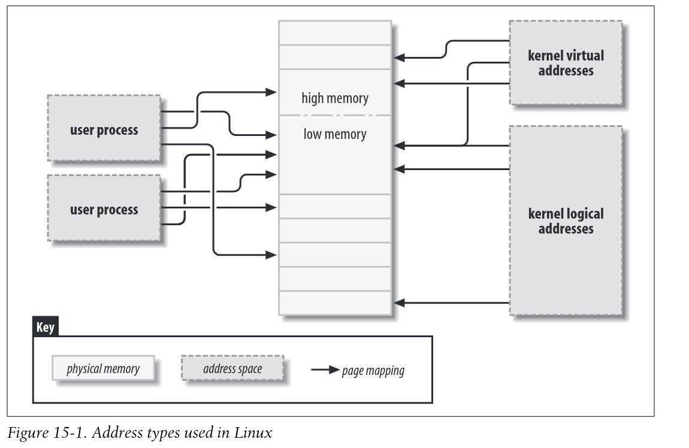

# DB Papers

## Page Cache/Buffer Manager

### [Are You Sure You Want to Use MMAP in Your Database Management System?](https://db.cs.cmu.edu/mmap-cidr2022/)

1. Transactional Safety
    * OS can flush dirty pages at any time, cannot prevent this
2. I/O Stalls
    * Not sure which pages in memory, can cause an i/o stall
3. Error handling
    * Validating pages
    * Any access can cause a SIGBUS
4. Performance issues
    * Each CPU core has its own TLB which can get out of sync with the page table. Thus, OS generally has to interrupt all CPU cores ("TLB Shootdown") when the page table changes.
    * Intra-kernel data structures are a scalability bottleneck

### [LeanStore: In-Memory Data Management Beyond Main Memory](https://db.in.tum.de/~leis/papers/leanstore.pdf)

*Pointer Swizzling*

### [Virtual-Memory Assisted Buffer Management](https://www.cs.cit.tum.de/fileadmin/w00cfj/dis/_my_direct_uploads/vmcache.pdf)

#### VMCache

1. Yes, you can exploit the virtual memory subsystem without losing control over eviciton and page fault handling (transactional safety, i/o stalls, and error handling)
2. A bonus is can enable dynamic page sizes due to a contiguous virtual memory range (from non-contiguous physical memory)

**Basic vmcache**

Basic vmcache suffers the same out-of-memory performance issues as mmap, identified by the mmap paper. But solves the others

1. Set up virtual memory with an anonymous mapping. No file descriptor is specified, storage is handled explicitly

```c
int flags = MAP_ANONYMOUS|MAP_PRIVATE|MAP_NORESERVE;
int prot = PROT_READ | PROT_WRITE;
char* virtMem = mmap(0, vmSize, prot, flags, -1, 0);
```

2. Add pages to cache by explicitly reading it from storage into the anonymous virtual memory. Buffer manager controls the page misses explicitly.

```c
uint64_t offset = 3 * pageSize;
pread(fd, virtMem + offset, pageSize, offset);
```

3. Evict pages before the buffer pool runs out of physical memory. `MADV_DONTNEED` removes the physical page from the page table and makes the physical memory available for future allocations.

```c
// If dirty first write
pwrite(fd, virtMem + offset, pageSize, offset)
madvise(virtMem + offset, pageSize, MADV_DONTNEED);
```

**Synchronization**

Need an additional data structure for synchronization because:

1. Not all page accesses traverse the page table. If page translation is cached in the TLB of a particular thread, does not need to consult the page table.
2. The page table cannot be directly manipulated from user space.

**Data Structure**

A contiguous array with as many page state entries as pages on storage


#### Page States

On startup all pages are in the `Evicted` state

## General Synchronization

* [Optimistic Lock Coupling: A Scalable and Efficient General-Purpose Synchronization Method](http://sites.computer.org/debull/A19mar/p73.pdf)

### [The ART of Practical Synchronization](https://db.in.tum.de/~leis/papers/artsync.pdf)

> To add support for concurrency, we initially started
> designing a custom protocol called Read-Optimized Write Exclusion (ROWEX) [ 14 ], which turned out to be
> non-trivial and requires modifications of the underlying data structure3. However, fairly late in the project, we
> also realized, that OLC alone (rather than as part of a more complex protocol) is sufficient to synchronize ART.
> No other changes to the data structure were necessary. Both approaches were published and experimentally
> evaluated in a followup paper [14], which shows that, despite its simplicity, OLC is efficient, scalable, and
> generally outperforms ROWEX
> 
> -- Page 75 from Optimistic Lock Coupling

## BTree

To Read:

* [Building a Bw-Tree Takes More than Just Buzz Words](https://www.cs.cmu.edu/~huanche1/publications/open_bwtree.pdf)
* [Contention and Space Management in B-Trees](https://www.cidrdb.org/cidr2021/papers/cidr2021_paper21.pdf)
* [MV-PBT: Multi-Version Index for Large Datasets and HTAP Workloads](https://arxiv.org/pdf/1910.08023.pdf)
* [Making B+ Trees Cache Conscious in Main Memory](https://dl.acm.org/doi/pdf/10.1145/342009.335449)
* [Contention and Space Management in B-Trees](https://www.cidrdb.org/cidr2021/papers/cidr2021_paper21.pdf)
* [Benchmarked against Bw-Tree](https://www.cs.cmu.edu/~huanche1/publications/open_bwtree.pdf)
* [A survey of b-tree locking techniques](https://15721.courses.cs.cmu.edu/spring2017/papers/06-latching/a16-graefe.pdf)

Code:

* [index-microbench](https://github.com/wangziqi2016/index-microbench)
    * Used for the Bw-Tree paper
    * Include a b-tree implementation of OLC

### [Modern B-Tree Techniques](https://w6113.github.io/files/papers/btreesurvey-graefe.pdf)

> • Latching coordinates threads to protect in-memory data
> structures including page images in the buffer pool. Lock-
> ing coordinates transactions to protect database contents.
>
> • Deadlock detection and resolution is usually provided for
> transactions and locks but not for threads and latches. Dead-
> lock avoidance for latches requires coding discipline and latch
> acquisition requests that fail rather than wait.
>
> • Latching is closely related to critical sections and could
> be supported by hardware, e.g., hardware transactional
> memory
>
> -- Page 268

## In Memory Data Structures

To Read:

* [](https://db.cs.cmu.edu/papers/2019/p211-sun.pdf)

Code:

* [Congee - ART-OLC concurrent adaptive radix tree](https://github.com/XiangpengHao/congee)

## LSM Tree

* [Real-Time LSM-Trees for HTAP Workloads](https://arxiv.org/pdf/2101.06801.pdf)
* [Hybrid Transactional/Analytical Processing Amplifies IO in LSM-Trees](https://ieeexplore.ieee.org/stamp/stamp.jsp?tp=&arnumber=9940292)
* [Revisiting the Design of LSM-tree Based OLTP Storage Engine
with Persistent Memory](http://www.cs.utah.edu/~lifeifei/papers/lsmnvm-vldb21.pdf)

## Storage Layout

* [The Design and Implementation of Modern Column-Oriented Database Systems](https://stratos.seas.harvard.edu/files/stratos/files/columnstoresfntdbs.pdf)
* [Adaptive Hybrid Indexes](https://db.in.tum.de/~anneser/ahi.pdf)

###  [Proteus: Autonomous Adapative Storage for Mixed Workloads](https://cs.uwaterloo.ca/~mtabebe/publications/abebeProteus2022SIGMOD.pdf)

#### Row Layout

*In Memory*

* Fixed-size byte array
    * Once written, becomes read-only
    * Size is determined by the table schema and columns in the partition
    * Variable sized data gets 12 bytes: 4 for data size, 8 for pointer (or data itself if fits)
    * Multi-versioned: last 8 bytes stores pointer to a byte array of the previous version of the row
* Partition maintains an array of pointers to each row's most recent version (aka byte array)

*On-Disk*

* Data is divided into index & stored data entry
    * Index contains offset into the row's data
    * Row stored same as in-memory but variable-sized data is always inlined
* Supports in-place updates if the data size does not change, otherwise requires rewriting the partition
* Buffers updates in memory and batch applies them

* [](https://cs.uwaterloo.ca/~mtabebe/publications/abebeThesis2022UW.pdf)

# Postgres Design

[Internals](https://www.interdb.jp/pg/)

# Linux Kernel

Notes on kernel internals relevant to SnowfallDB (use of exmap)

## Address Types

1. User virtual addresses: seen by user-space programs. Each proccess has its own virtual address space
2. Physical Addresses: used between processor and system's memory.
3. Kernel logical addresses: Normal address space of the kernel. `kmalloc` returns kernel logical addresses. Treated as physical addresses (usually differ by a constant offset). Macro `__pa()` in `<asm/page.h` returns the associated physical address.
4. Kernel virtual addresses: do not necessary have a linear one to one mapping to physical addresses. All logical addresses _are_ vritual addresses. `vmalloc` returns a virtual address (but no direct physical mapping)



# SnowfallDB Design

## Page Cache/Buffer Management

Uses the exmap kernel module with vmcache implemented over it.

* Page Sizes: Pages are minimum 4KB but supports variable page sizes due to it being contiguous virtual memory.
* Concurrency: exclusive writes, shared reads, and optimistic reads.
    * Goes to sleep (parking lot method) when cannot gain an exclusive write or shared read

### Optimistic Reads

Optimistic reads on vmcache+exmap can result in a segfault. This is because during the read the page may be evicted. Thus we need to handle the segfault somehow. Either through the `SIGSEGV` signal or a `userfaultfd`.

Need to do both and benchmark:

1. Perform the entire read and cause many faults without the overhead of a signal handler
2. Perform the read only until a segfault occurs, handle it by jumping out

#### Rust signal handling and non-local jumps

Links:
* [How setjmp and longjmp work](https://offlinemark.com/2016/02/09/lets-understand-setjmp-longjmp/)
* [Working with signals in Rust - some things that signal handlers can't handle](https://www.jameselford.com/blog/working-with-signals-in-rust-pt1-whats-a-signal/)

My port of musl setjmp/longjmp to rust: [sjlj](https://github.com/jordanisaacs/sjlj)

Safety of setjmp/longjmp:

* The [Plain Old Frame](https://blog.rust-lang.org/inside-rust/2021/01/26/ffi-unwind-longjmp.html) are frames that can be trivially deallocated. A function that calls `setjmp` cannot have any destructors.
* Also take care for [returning twice](https://github.com/rust-lang/rfcs/issues/2625) and doing volatile read/writes if that is the case

From [anonymous]: 

> you can't longjmp in a signal handler because you need to either hit the return trampoline
> or sigreturn you can modify the sigcontext to resume your setlongjmp-style context instead though

Tidbit on the return trampoline

> when the kernel delivers a signal it creates a new stack to run your handler on.
> libcs will set the return address for the stack (or the link register on other architectures etc)
> to be a "trampoline" which is just a small snippet that calls sigreturn so that returning
> from the handler resumes execution of your program correctly.
> [link to linux kernel](https://github.com/torvalds/linux/blob/d6c338a741295c04ed84679153448b2fffd2c9cf/arch/x86/um/signal.c#L360).
> it's that signal registering sets SA_RESTORER which the kernel sets as the return address for the signal handler stack,
> and im pretty sure libcs just have their sigaction etc always set SA_RESTORER to their sigreturn trampoline

Rather than using `longjmp`, restore the `jmp_buf` into `sigcontext`.

#### Userfaultfd

`man 2 userfaultd`

File descriptor that handles page faults in user space. Alternative to signal handling and setjmp + sigcontext.

## Index

BTree for indexing (what type?)

* Optimistic lock coupling (The ART and Optimistic Lock Coupling paper)
* Contention management

## Page layout

### 

Hybrid storage layout (proteus?)

