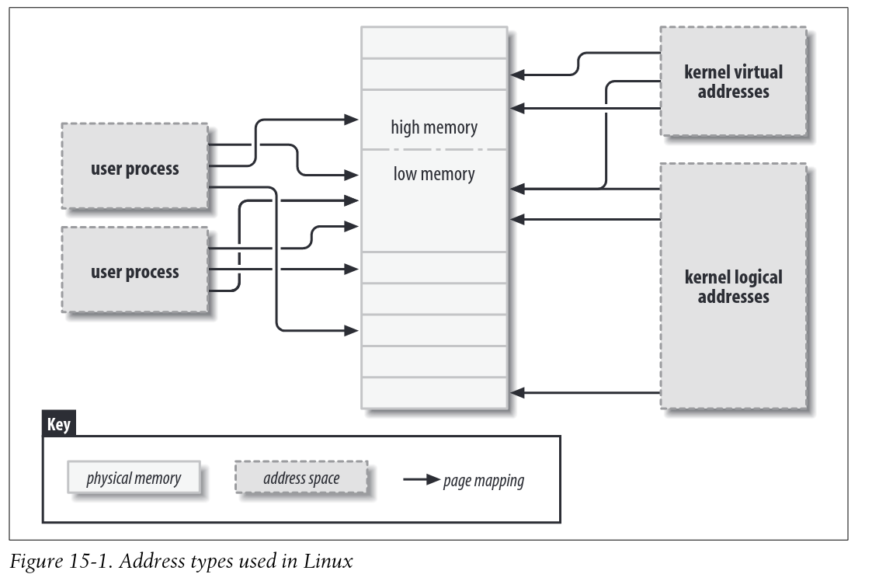
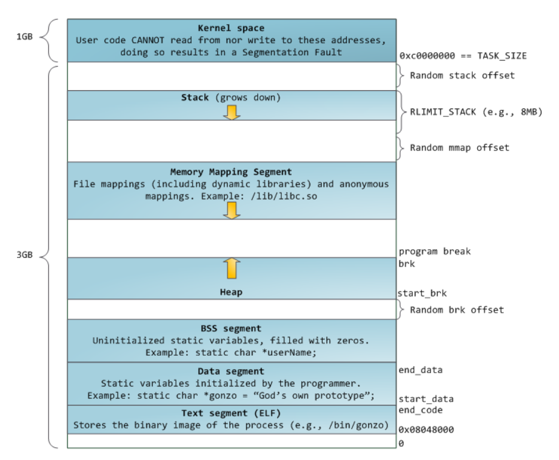
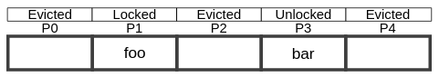

# Unsorted links

[FAST 23' - Citron: Distributed Rnage Lock Management with One-sided RDMA](https://www.youtube.com/watch?v=_Aegd52O_Hg)

# Memory/Elf/Program Startup

## Kernel Memory

### Address Types

1. User virtual addresses: seen by user-space programs. Each proccess has its own virtual address space 2. Physical Addresses: used between processor and system's memory.
3. Kernel logical addresses: Normal address space of the kernel. `kmalloc` returns kernel logical addresses. Treated as physical addresses (usually differ by a constant offset). Macro `__pa()` in `<asm/page.h` returns the associated physical address.
4. Kernel virtual addresses: do not necessary have a linear one to one mapping to physical addresses. All logical addresses _are_ vritual addresses. `vmalloc` returns a virtual address (but no direct physical mapping)



### Kernel GFP Flags

[link](https://lwn.net/Articles/920891/)

They are "get free page" flags, but now used much more widely. But only relevant for *full-page* allocations

### VMTouch

[link](https://hoytech.com/vmtouch/)

A tool to learn and control the file-system cache on unix and unix-like systems

Using it to investigate sqlite performance: [link](https://brunocalza.me/p/ff33a375-0f21-4bba-8ce2-2f472ef4e6b8/)

Linux portion that was yanked out of vmtouch: [link](https://gist.github.com/tvaleev/c3489f8a25449fcefac5847cdb05cb3c)

`man 2 mincore`

Powered by the `mincore` syscall which returns whether pages are in RAM. AKA detect if the memory will cause a page fault if accessed.

## Linux Program Startup

### Linux x86 Program Start Up - or - How the heck do we get to main()

[link](http://www.dbp-consulting.com/tutorials/debugging/linuxProgramStartup.html)

## Process Memory

### Anatomy of a Program in Memory

[link](https://manybutfinite.com/post/anatomy-of-a-program-in-memory/)

Each process (in a multi-tasking OS) has its own memory sandbox, which is a virtual address space. Virtual addresses are mapped to physical memory through page tables, maintained by the kernel (and consulted by the processor). Once VA are enabled, all software including the kernel use it.

Some amount of the VA space must be reserved for the kernel. Because kernel space is flagged in the page table as exlusive to priviliged code (ring 2 or lower). Page fault is triggered if user mode programs try to touch it.

Kernel code is always addressable, ready to handle interrupts/system calls. User-mode memory changes when a process switch happens. A process has distinct bands, ranges of memory addresses, in address space correpsonding to **memory segments**.



### sbrk() is not thread safe

[link](https://lifecs.likai.org/2010/02/sbrk-is-not-thread-safe.html)

### sbrk() vs mmap()

[link](https://utcc.utoronto.ca/~cks/space/blog/unix/SbrkVersusMmap)

The highest address is called the *program break*. At program startup it would be the space at the top of the [bss](https://en.wikipedia.org/wiki/.bss): statically allocated variables. `brk()` and `sbrk()` are used to set and increment/decrement the program break respectively. Thus, gives you more memory and creates the *heap*.

In classical unix if you `free()` the right block at the top of the break, `malloc()` might eventually shrink the program break. This was simple linear memory. `mmap()` allowed for easily doing different 'arenas' of memory. Can also be used to directly allocate large objects. Then can drop mappings when unneeded or shrink the arenas. Still called the *heap* even though it is no longer continuous and linear.

## ELF

### Program Startup

#### A Whirlwind Tutorial on Creating Really Teensy ELF Executables for Linux

[link](http://www.muppetlabs.com/~breadbox/software/tiny/teensy.html)

libc have a `_start` and an `_exit` routine. These provide portability for starting up and ending a program. You can create your own `_start` with the GCC option `-nostartfiles`. You need to call `_exit` though. You can use the GCC option `-nostdlib` to not link any system libraries or startup files.

Can use the `exit(2)` syscall rather than the libc call.

There is still the ELF file though with a large amount of overhead. There are a variety of different sections that are produced by the assembler.

TODO: finish notes

#### How programs get run: ELF binaries

[link](https://lwn.net/Articles/631631/)

### `man 5 elf`

### ELF Sections

#### text, data, and bss: Code and Data Size Explained*

[link](https://mcuoneclipse.com/2013/04/14/text-data-and-bss-code-and-data-size-explained/)

`.text` has functions & constant data (). In FLASH memory.

`.data` has initialized data. `int32_t x = 1235;` Not constant because can be changed. Counts for RAM & FLASH

`.bss` has uninitialized data. `int32_t x`. Counts for RAM

### Auxiliary Vectors

#### About ELF Auxiliary Vectors*

[link](http://articles.manugarg.com/aboutelfauxiliaryvectors.html)

They are a mechanism to transfer certain kernel level information to the user processes. They are on the process stack after `envp` content, separated by  a null pointer. In C programs can pass `LD_SHOW_AUXV=1` to print out auxiliary vectors.

#### Linux Kernel

`auxp` is filled in [binfmt_elf.c](https://github.com/torvalds/linux/blob/fc89d7fb499b0162e081f434d45e8d1b47e82ece/fs/binfmt_elf.c#L242)

#### Rustix/Origin/Mustang

Rustix uses the `auxp` for params. It takes in `envp` and finds the null pointer separating it from `auxp`. Then it parses it: [link](https://github.com/bytecodealliance/rustix/blob/dd3de92d498f2f2bde6a312d42bbcd810d1db596/src/backend/linux_raw/param/mustang_auxv.rs#L112). This is performed before main in rustix: [link](https://github.com/sunfishcode/mustang/blob/e5c4ff5abd0e29842652b03dfb594cece74ce71b/origin/src/program.rs#LL77C16-L77C16).

### Constructors/Destructors

#### Startup: Backward Constructors

[link](https://web.archive.org/web/20151205101506/https://blog.mozilla.org/tglek/2010/05/27/startup-backward-constructors/)

#### `.init, .ctors, and .init_array`

[link](https://maskray.me/blog/2021-11-07-init-ctors-init-array)

Dynamic initializations for non-local variables before the main function. Calls functions in `init_array`. GCC reserves the first 100. Catch violations with `-Wprio-ctor-dtor`.

See [System V ABI](https://refspecs.linuxbase.org/elf/x86_64-abi-0.99.pdf) for the generic ABI quote source

### Thread Locals

#### Elf Handling for Thread-Local Storage - spec

[link](https://akkadia.org/drepper/tls.pdf)

#### LLVM

[link](https://llvm.org/docs/LangRef.html#thread-local-storage-models)

A variable can be specified as `thread_local` which means each thread will have its own copy of the variable. Not all targets support this. Uses the ELF TLS models.

#### All about thread-local storage

[link](https://maskray.me/blog/2021-02-14-all-about-thread-local-storage)

#### A deep dive into (implicit) thread local storage

[link](https://chao-tic.github.io/blog/2018/12/25/tls)

#### alloc-tls - thread local storage for global allocators (rust)

[link](https://github.com/ezrosent/allocators-rs/tree/master/alloc-tls)

(rust) Registering destructors for types that implement `Drop` requires allocation. This causes reentrancy for allocators. `alloc_thread_local!` can detect this

## Rust Programs

### Origin

[link](https://github.com/sunfishcode/mustang/tree/main/origin)

Origin for logging uses a function in `.init_array` to set up an `env_logger`. Cannot be used in `no_std`. Need to write your own `.init_array` function

### main()

Use `#[start]` (tracking [issue](https://github.com/rust-lang/rust/issues/29633)) or override the C `main` function. [Source](https://doc.rust-lang.org/beta/unstable-book/language-features/lang-items.html#writing-an-executable-without-stdlib)

Rust stdlib uses the start function to initialize its [runtime](https://sourcegraph.com/github.com/rust-lang/rust/-/blob/library/std/src/rt.rs?L99%3A39=). A key thing to note is it uses a `panic::catch_unwind`. Panicking from a main function is undefined behavior right now (more notes in tracking issue). Inside it also calls the platform specific init. [unix init](https://sourcegraph.com/github.com/rust-lang/rust/-/blob/library/std/src/sys/unix/mod.rs?L53=).

### init_array and args

On unix stdlib uses init_array to initialize args because glibc passes argc, argv, and envp to function in the `.init_array`. See [source](https://github.com/rust-lang/rust/blob/6c991b07403a3234dd1ec0ac973b8ef97055e605/library/std/src/sys/unix/args.rs#L109)

# Linking

## A ToC of the 20 part linker essay

[link](https://lwn.net/Articles/276782/)

## Linkers and Loaders

[link](https://linker.iecc.com/)

##  A beginner's guide to linkers

[link](https://www.lurklurk.org/linkers/linkers.html#namemangling)

## LLVM Linkage Models

[link](https://llvm.org/docs/LangRef.html#linkage-types)

## Rust linkage feature

[tracking issue](https://github.com/rust-lang/rust/issues/29603)

# Stack Frames/Unwinding

## Don't panic: guide to rust unwinding

[link](https://lucumr.pocoo.org/2014/10/30/dont-panic/)

## DWARF-based Stack Walking Using eBPF

[link](https://www.polarsignals.com/blog/posts/2022/11/29/profiling-without-frame-pointers/)

# Linux System Calls

## Anatomy of a system call, part 1

[link](https://lwn.net/Articles/604287/)

Special instructions are needed to make the processor perform a transition to ring 0.
Functions are addressed by number rather than address.

In the kernel they are defined with the `SYSCALL_DEFINEn()` macro. It produces a `__SYSCALL_DEFINEx()` and a `SYSCALL_METADATA()` macro. The [metadata macro](https://lwn.net/Articles/604406/) builds a collection of metadata for tracing purposes (for `CONFIG_FTRACE_SYSCALLS`). The `__SYSCALL_DEFINEx()` expands to the actual syscall function. The type signatures are `long int` for correctly sign extending 32 bit values. They use the [asmlinkage](https://kernelnewbies.org/FAQ/asmlinkage) directive which tells that the function should expect arguments on the stack rather than registers.

To get to the function, a syscall table is used for mapping the numbers to function pointers. Syscall tables can be implemented differently for each architecture and have different syscall number mappings.

**x86_64**:

Early in the kernel's [startup](https://elixir.bootlin.com/linux/v3.14/source/arch/x86/kernel/cpu/common.c#L1277) sequence calls [syscall_init](https://elixir.bootlin.com/linux/v3.14/source/arch/x86/kernel/cpu/common.c#L1134). Uses the `wrmsrl` instruction to write values to a [model-specific register](https://wiki.osdev.org/Model_Specific_Registers). Wrties to `MSR_LSTAR` which is the x86\_64 register for `SYSCALL` instructions. We set it to `system_call`.

Table is accessed from the [system_call](https://elixir.bootlin.com/linux/v3.14/source/arch/x86/kernel/entry_64.S#L593) assembly entry point. Pushes various registers onto stack using `SAVE_ARGS` macro to match `asmlinkage` directive. Uses the RAX register to pick entry and then calls it.


## Anatomy of a system call part 2

[link](https://lwn.net/Articles/604515/)

Lays out how some other arches work and x86\_32 syscalls on x86\_64

**vDSO (Virtual Dynamically-linked Shared Object)**:

* Also see [Linux Journal](https://www.linuxjournal.com/content/creating-vdso-colonels-other-chicken)

Some system calls read a small amount of information from the kernel, do not want the overhead of a ring transition.

TODO

*syscall tracing with `ptrace()`*

TODO

# Tracing/Performance

Brendan Gregg's Linux Performance - [link](https://www.brendangregg.com/linuxperf.html)

[Performance Superpowers with Enhanced BPF](https://www.youtube.com/watch?v=oc9000dM9-k)

[Visualizing Performance with Flame Graphs](https://www.youtube.com/watch?v=D53T1Ejig1Q&t=1614s)

## ptrace

### Intercepting and emulating system calls with ptrace

[link](https://nullprogram.com/blog/2018/06/23/)

Ptrace to implement strace & native debuggers (eg gdb). It intercepts system calls. Can observe, mutate, or block them - means you can service the syscalls yourself. Emulate another OS?

Can only have one tracer attached to a process at a time, and has higher overhead. On linux x86-64 ptrace(2) has following signature `long ptrace(int request, pid_t pid, void *addr, void *data);`

## ftrace

### ftrace: trace your kernel #functions

[link](https://jvns.ca/blog/2017/03/19/getting-started-with-ftrace/)

### Debugging the kernel using Ftrace

[part 1 - link](https://lwn.net/Articles/365835/)
[part 2 - link](https://lwn.net/Articles/366796/)

# Systemd

## Systemd by example

[link](https://seb.jambor.dev/posts/systemd-by-example-part-1-minimization/)

# Posix Shell

## Spec

[link](https://pubs.opengroup.org/onlinepubs/9699919799/)

# Linux I/O

How much I/O do you want to handle in userspace vs kernel?

## HeuristicDB: A Hybrid Storage Database System Using a Non-Volatile Memory Block Device

[link](https://dl.acm.org/doi/pdf/10.1145/3456727.3463774)

Use NVM storage as a block cache for conventional storage devices

## OPTR: Order-Preserving Translation and Recovery Design for SSDs with a Standard Block Device Interface

[link](https://www.usenix.org/system/files/atc19-chang_0.pdf)

## Linux Kernel Block Layer

The block layer is the part of the kernel that implements the interface that applications/filesystems use to access storage devices.

* [Part 1: the bio layer](https://lwn.net/Articles/736534/)
* [Part 2: the request layer](https://lwn.net/Articles/738449/)

[Block-device snapshots with with blksnap module](https://lwn.net/Articles/914031/)

[Linux Kernel Labs - Block Device Drivers](https://linux-kernel-labs.github.io/refs/heads/master/labs/block_device_drivers.html)

### The Necessary Death of the Block Device Interface

[link](https://nivdayan.github.io/NecessaryDeath.pdf) *ssd*

## NVMe

### Character and Block Device

[link](https://serverfault.com/questions/892134/why-is-there-both-character-device-and-block-device-for-nvme)

The character device `/dev/nvme0` is the NVMe controller. While the block devices eg `/dev/nvme0n1` are storage namespaces. They behave essentially as disks. Erasing the SSD does not erase the namespaces.

### xnvme

[link](https://xnvme.io/)

[Paper](https://dl.acm.org/doi/10.1145/3534056.3534936)

Provides a cross-platform user-space library that is I/O interface independent. Includes backends of its API for SPDK, io_uring, libaio, and more. According to the paper it has negligible cost.

Designed to be rapidly iterable to include new NVMe features.

### Enabling Asynchronous I/O Passthru in NVMe-Native Applications

[link](https://www.snia.org/educational-library/enabling-asynchronous-i-o-passthru-nvme-native-applications-2021)

## SPDK

[link](https://spdk.io/doc/)

**All userspace**

SPDK is a way to bypass the OS and directly access an NVME storage device. It is a "user space, polled-mode, asynchronous, lockless NVME driver"

Normally drivers run in kernel space. SPDK contains drivers that run in userspace but still interface directly with the hardware device.

It does this by telling the OS to relinquish control. Done by [writing to a file in sysfs](https://lwn.net/Articles/143397/). Then it rebinds the device to either [uio](https://www.kernel.org/doc/html/latest/driver-api/uio-howto.html) or [vfio](https://www.kernel.org/doc/Documentation/vfio.txt) which act as "dummy drivers". Prevent the OS from attempting to re-bind. vfio is capable of programming the [IOMMU](https://en.wikipedia.org/wiki/Input%E2%80%93output_memory_management_unit) unlike uio. See [DMA from user space](https://spdk.io/doc/memory.html)

Once unbound, OS can't use the device anymore: eg `/dev/nvme0n1` dissapears. SPDK provides re-imagined implementations of most layers in the typical OS storage stack as c libraries.

A TiKV article on using SPDK BlobFS: [link](https://www.pingcap.com/blog/tikv-and-spdk-pushing-the-limits-of-storage-performance/)

[SPDK BDev Performance Report](https://ci.spdk.io/download/performance-reports/SPDK_nvme_bdev_perf_report_2209.pdf) - A full block device layer in userspace called `bdev`

## io-uring

### ioctl() for io_uring

[link](https://lwn.net/Articles/844875/)

Implement a field in the `file_operations` structure

```c
struct io_uring_cmd {
    struct file *file;
    struct io_uring_pdu pdu;
    void (*done)(struct io_uring_cmd *, ssize_t);
};

int (*uring_cmd)(struct io_uring_cmd *, enum io_uring_cmd_flags);
```

Handlers should not block. Instead

1. Complete immediately
2. Return error indicating operation would block
3. Run it asynchronously and signal completion by calling the given `done()` function

### io_uring and networking in 2023

[link](https://github.com/axboe/liburing/wiki/io_uring-and-networking-in-2023)

### Missing manuals - io_uring worker pool

[link](https://blog.cloudflare.com/missing-manuals-io_uring-worker-pool/)

# Confidential Computing

## [What is Confidential Computing](https://spectrum.ieee.org/what-is-confidential-computing)

Confidential computing is about protecting data while in use. So malware can't just dump your memory while you are computing on it. This is important for cloud computing because when you don't control the datacenter and hardware, you can't trust that the host OS isn't compromised.

## Intel SGX

## AMD SEV

* [AMD Developer Page](https://developer.amd.com/sev/)

### [AMD SEV-SNP Whitepaper](https://www.amd.com/system/files/TechDocs/SEV-SNP-strengthening-vm-isolation-with-integrity-protection-and-more.pdf)

SEV (Secure Encrypted Virtualization) enabled main memory encryption. Individual VMs could be assigned unique AES encryption keys to encrypt in-use data. When the hypervisor tries to read memory inside a guest, only sees encrypted bytes.

SEV-ES (SEV - Encrypted State) enabled additional protection for CPU register state. Each VM's register state was encrypted during the hypervisor transition so hypervisor can't see data being used by the VM.

SEV-SNP (SEV - Secure Nested Paging) adds strong memory integrity protection

SEV encryption key is generated from hardware RNG and stored in dedicated hardware register. Software can't directly read it. Identical plaintext at different memory lcoations are encrypted differently.

An attacker can change values in memory without knowing the encryption key - an *integrity attack*. Can corrupt memory so VM gets random values. VM is generally unaware when memory integrity is compromised and situation is hard to predict.

> The basic principle of SEV-SNP integrity is that if a VM is able to read a private (encrypted) page of memory, it must always read the value it last wrote.

### The Linux SVSM project

[link](https://lwn.net/Articles/921266/)

### A Comparison Study of Intel SGX and AMD Memory Encryption Technology

[link](https://caslab.csl.yale.edu/workshops/hasp2018/HASP18_a9-mofrad_slides.pdf)

# Posix Threads

## `man 7 pthreads`

*Thread IDs*: Each thread has a unique thread identifier (`pthread_t`). Only guaranteed to be unique within a process. System can re-use thread IDs after a terminated thread has been joined, or a detached thread has terminated.

*Cancellation*:

* `PTHREAD_CANCEL_ASYNCHRONOUS`: Thread can be canceled at any time. Must be `async-cancel-safe` functions. Cannot safely reserve any resources.
* `PTHREAD_CANCEL_DEFERRED`: Thread can be canceled at functions that are required to to be cancellation points. A thread will be cancelled if a function is called that is a cancellation point and a cancellation request is pending. Other functions not specified can also be cancellation points.

## libc/NPTL/LinuxThreads

*Implementations*:

`LinuxThreads` was original linux implementation. Not supported since glibc 2.4

`NPTL (Native POSIX Threads Library)`:
* Requires kernel 2.6 and available since glibc 2.3.2
* All threads in a process are in the same thread group, thus share the same PID
* Uses the first two real-time signals internally. Cannot be used in applications
* `POSIX.1` nonconformance: threads don't share a common nice value

`libpthread` before glibc 2.34 was a separate library. After 2.34 it was brought into the main `libc` object, `libc.so.6`. It was done after musl did it. See [source](https://developers.redhat.com/articles/2021/12/17/why-glibc-234-removed-libpthread#the_developer_view)

They are 1:1 implementations. Each thread maps to a kernel scheduling identity. Utilize the `clone(2)` syscall. Thread synchronization primitives are implemented using the `futex(2)` syscall.

## mustang/origin/c-scape

c-scape's [implementation](https://github.com/sunfishcode/mustang/tree/main/c-scape/src/threads) of posix threads are built on top of origin's [thread runtime](https://github.com/sunfishcode/mustang/blob/main/origin/src/threads.rs).

One issue with c-scape is that it is `libc` compatible so the functions are `extern "C"`. Thus required to switch from Rust to "C" ABI, then back into rust, and then into C-like syscalls. [source](https://github.com/sunfishcode/mustang/issues/123#issue-1283959957)

# Filesystems

## bcachefs

[The Programmer's Guide to bcache](https://bcachefs.org/Architecture/)

[bcachefs: Principles of Operation](https://bcachefs.org/bcachefs-principles-of-operation.pdf)

# Checksums

[Selecting a Checksum algorithm](http://fastcompression.blogspot.com/2012/04/selecting-checksum-algorithm.html)

# QEMU

## Block Devices

* [A practical look at QEMU's Block Layer Primitives](https://kashyapc.fedorapeople.org/virt/LinuxCon-NA-2016/A-Practical-Look-at-QEMU-Block-Layer-Primitives-LC-NA-2016.pdf)
* [How to emulate block devices with qemu](https://blogs.oracle.com/post/how-to-emulate-block-devices-with-qemu)

# Concurrency

[What every systems programmer should know about concurrency](https://assets.bitbashing.io/papers/concurrency-primer.pdf)

## Memory models

[Understanding memory reordering](https://www.internalpointers.com/post/understanding-memory-ordering)

[Memory Consistency Models: A Tutorial](https://www.cs.utexas.edu/~bornholt/post/memory-models.html)

[Cache coherency primer](https://fgiesen.wordpress.com/2014/07/07/cache-coherency/)

[std::memory_order](https://en.cppreference.com/w/cpp/atomic/memory_order)

# Page Cache/Buffer Manager

## Are You Sure You Want to Use MMAP in Your Database Management System?

[link](https://db.cs.cmu.edu/mmap-cidr2022/)

1. Transactional Safety
    * OS can flush dirty pages at any time, cannot prevent this
2. I/O Stalls
    * Not sure which pages in memory, can cause an i/o stall
3. Error handling
    * Validating pages
    * Any access can cause a SIGBUS
4. Performance issues
    * Each CPU core has its own TLB which can get out of sync with the page table. Thus, OS generally has to interrupt all CPU cores ("TLB Shootdown") when the page table changes.
    * Intra-kernel data structures are a scalability bottleneck

## LeanStore: In-Memory Data Management Beyond Main Memory

[link](https://db.in.tum.de/~leis/papers/leanstore.pdf)

*Pointer Swizzling*

## Virtual-Memory Assisted Buffer Management

[link](https://www.cs.cit.tum.de/fileadmin/w00cfj/dis/_my_direct_uploads/vmcache.pdf)

### VMCache

1. Yes, you can exploit the virtual memory subsystem without losing control over eviciton and page fault handling (transactional safety, i/o stalls, and error handling)
2. A bonus is can enable dynamic page sizes due to a contiguous virtual memory range (from non-contiguous physical memory)

**Basic vmcache**

Basic vmcache suffers the same out-of-memory performance issues as mmap, identified by the mmap paper. But solves the others

1. Set up virtual memory with an anonymous mapping. No file descriptor is specified, storage is handled explicitly

```c
int flags = MAP_ANONYMOUS|MAP_PRIVATE|MAP_NORESERVE;
int prot = PROT_READ | PROT_WRITE;
char* virtMem = mmap(0, vmSize, prot, flags, -1, 0);
```

2. Add pages to cache by explicitly reading it from storage into the anonymous virtual memory. Buffer manager controls the page misses explicitly.

```c
uint64_t offset = 3 * pageSize;
pread(fd, virtMem + offset, pageSize, offset);
```

3. Evict pages before the buffer pool runs out of physical memory. `MADV_DONTNEED` removes the physical page from the page table and makes the physical memory available for future allocations.

```c
// If dirty first write
pwrite(fd, virtMem + offset, pageSize, offset)
madvise(virtMem + offset, pageSize, MADV_DONTNEED);
```

**Synchronization**

Need an additional data structure for synchronization because:

1. Not all page accesses traverse the page table. If page translation is cached in the TLB of a particular thread, does not need to consult the page table.
2. The page table cannot be directly manipulated from user space.

**Data Structure**

A contiguous array with as many page state entries as pages on storage



#### Page States

On startup all pages are in the `Evicted` state

# General Synchronization

* [Optimistic Lock Coupling: A Scalable and Efficient General-Purpose Synchronization Method](http://sites.computer.org/debull/A19mar/p73.pdf)

## The ART of Practical Synchronization

[link](https://db.in.tum.de/~leis/papers/artsync.pdf)

> To add support for concurrency, we initially started
> designing a custom protocol called Read-Optimized Write Exclusion (ROWEX) [ 14 ], which turned out to be
> non-trivial and requires modifications of the underlying data structure3. However, fairly late in the project, we
> also realized, that OLC alone (rather than as part of a more complex protocol) is sufficient to synchronize ART.
> No other changes to the data structure were necessary. Both approaches were published and experimentally
> evaluated in a followup paper [14], which shows that, despite its simplicity, OLC is efficient, scalable, and
> generally outperforms ROWEX
> 
> -- Page 75 from Optimistic Lock Coupling

# BTree

To Read:

* [Building a Bw-Tree Takes More than Just Buzz Words](https://www.cs.cmu.edu/~huanche1/publications/open_bwtree.pdf)
* [Contention and Space Management in B-Trees](https://www.cidrdb.org/cidr2021/papers/cidr2021_paper21.pdf)
* [MV-PBT: Multi-Version Index for Large Datasets and HTAP Workloads](https://arxiv.org/pdf/1910.08023.pdf)
* [Making B+ Trees Cache Conscious in Main Memory](https://dl.acm.org/doi/pdf/10.1145/342009.335449)
* [An Asymptotically Optimal Multiversion B-tree](https://www.cs.bu.edu/faculty/gkollios/ada17/LectNotes/mvbt.pdf)
* [Contention and Space Management in B-Trees](https://www.cidrdb.org/cidr2021/papers/cidr2021_paper21.pdf)
* [Benchmarked against Bw-Tree](https://www.cs.cmu.edu/~huanche1/publications/open_bwtree.pdf)
* [A survey of b-tree locking techniques](https://15721.courses.cs.cmu.edu/spring2017/papers/06-latching/a16-graefe.pdf)
* [concept to internals](http://web.archive.org/web/20161221112438/http://www.toadworld.com/platforms/oracle/w/wiki/11001.oracle-b-tree-index-from-the-concept-to-internals)

Code:

* [index-microbench](https://github.com/wangziqi2016/index-microbench)
    * Used for the Bw-Tree paper
    * Include a b-tree implementation of OLC


## B-trees: More than I thought I'd want to know

[link](https://benjamincongdon.me/blog/2021/08/17/B-Trees-More-Than-I-Thought-Id-Want-to-Know/)

**Two important quantities**

1. *Key comparisons*
2. *Disk seeks*

Key comparisons scales with the dataset, cannot do much to change that. But we can influence the # of key comparisons per disk seek. Done by co-locating keys together in the on-disk layout. This is where **high fanout** comes from.

**Slotted Page Layout**

1. The header (start of page) - metadata
2. Offset pointers (after header) - point to cells
2. Cells (end of page) - variable-sized "slots" for data

Do not need to re-order/move data (aka cells), just the offset pointers

**Lookup**

Basic algorithm

1. Root node
2. Perform binary search on the *separator keys* within the node. Goo to child node
3. Go back to step 2 if not a leaf
4. If at leaf, get the data

## Modern B-Tree Techniques

[link](https://w6113.github.io/files/papers/btreesurvey-graefe.pdf)

### Basic B-Trees** (pg. 213-216):

**Types of Nodes**:

1. Single root
    * Contains at least one key and two child pointers
    * Contain separator keys
2. Branch nodes connecting root and leaves
    * Contain separator keys that may be equal to keys of current or former data
    * Only requirement is to guide the search algorithm
    * $N$ separator keys means $N + 1$ child pointers
3. Leaf nodes
    * Contain user data
    * Records in leaf nodes contain a search key + associated information
    * Associated information can be columns, a pointer, etc. (not important to this survey)

* Branch + leaf nodes are at least half full at all times
* B/c only leaf node contains user data, deletion does not affect branch nodes
* Short separator keys increases node fan-out (# of child pointers per node)
* Entries are kept in sorted order
* Only child pointers are truly required, but many implementations contain neighbor pointers.
    * Rarely a parent pointer b/c forces updates in many child nodes when parent is moved/split
* On-disk tree tends to represent child pointers as page identifiers
* Page headers include metadata information
* A node is aligned to a page size

**Fan-out math**:

* $N$ records and $L$ records per leaf -> $N/L$ leaf nodes
* $F$ average children per parent -> $log_F(N/L)$ branch levels

Ex: 9 leaf nodes, F = 3 -> $log_3(9) = 2$. Height is either 2 or 3 depending on if including leaves. Usually round up b/c root node has different fan-out

* Average space utilization is about 70%, always between 50% and 100%.
* Often more than 99% of nodes are leaf

**Algorithms**::

TBD

> • Latching coordinates threads to protect in-memory data
> structures including page images in the buffer pool. Lock-
> ing coordinates transactions to protect database contents.
>
> • Deadlock detection and resolution is usually provided for
> transactions and locks but not for threads and latches. Dead-
> lock avoidance for latches requires coding discipline and latch
> acquisition requests that fail rather than wait.
>
> • Latching is closely related to critical sections and could
> be supported by hardware, e.g., hardware transactional
> memory
>
> -- Page 268

# In Memory Data Structures

To Read:

* [](https://db.cs.cmu.edu/papers/2019/p211-sun.pdf)

Code:

* [Congee - ART-OLC concurrent adaptive radix tree](https://github.com/XiangpengHao/congee)

# LSM Tree

* [Real-Time LSM-Trees for HTAP Workloads](https://arxiv.org/pdf/2101.06801.pdf)
* [Hybrid Transactional/Analytical Processing Amplifies IO in LSM-Trees](https://ieeexplore.ieee.org/stamp/stamp.jsp?tp=&arnumber=9940292)
* [Revisiting the Design of LSM-tree Based OLTP Storage Engine
with Persistent Memory](http://www.cs.utah.edu/~lifeifei/papers/lsmnvm-vldb21.pdf)

# Storage Layout

* [The Design and Implementation of Modern Column-Oriented Database Systems](https://stratos.seas.harvard.edu/files/stratos/files/columnstoresfntdbs.pdf)
* [Adaptive Hybrid Indexes](https://db.in.tum.de/~anneser/ahi.pdf)

## Proteus: Autonomous Adapative Storage for Mixed Workloads

[link](https://cs.uwaterloo.ca/~mtabebe/publications/abebeProteus2022SIGMOD.pdf)

### Row Layout

*In Memory*

* Fixed-size byte array
    * Once written, becomes read-only
    * Size is determined by the table schema and columns in the partition
    * Variable sized data gets 12 bytes: 4 for data size, 8 for pointer (or data itself if fits)
    * Multi-versioned: last 8 bytes stores pointer to a byte array of the previous version of the row
* Partition maintains an array of pointers to each row's most recent version (aka byte array)

*On-Disk*

* Data is divided into index & stored data entry
    * Index contains offset into the row's data
    * Row stored same as in-memory but variable-sized data is always inlined
* Supports in-place updates if the data size does not change, otherwise requires rewriting the partition
* Buffers updates in memory and batch applies them

* [](https://cs.uwaterloo.ca/~mtabebe/publications/abebeThesis2022UW.pdf)

# Postgres Design

[Internals](https://www.interdb.jp/pg/)

[PostgreSQL 14 Internals](https://edu.postgrespro.com/postgresql_internals-14_en.pdf)

# Rust Cargo Builds

## Resolver 2

[link](https://doc.rust-lang.org/cargo/reference/resolver.html#feature-resolver-version-2)

Defaults to version 2 when edition is 2021. Features enabled on build-dependencies or proc-macros are not unified when same dependencies are used as a normal dependency. Eg proc-macros won't pull in std for your no_std build.

# Nix Builds

## Status of lang2nix approaches

[link](https://discourse.nixos.org/t/status-of-lang2nix-approaches/14477?u=snowytrees)

## rust2nix Comparisons

[link](https://discourse.nixos.org/t/cargo2nix-dramatically-simpler-rust-inside-nix/9334/2?u=snowytrees)

`buildRustCrate` + `crate2nix` is most Nix-native approach. Each crate and its dependent is a separate Nix derivation + output path. Crates only re-compiled when necessary. Output paths can be shared between different rust projects.

## sysroot

Using a sysroot to cross compile `core` and `std`. rustc can cross compile so do not need to build rust itself for the target platform. The sysroot is just a crate that depends directly on core, std, and compiler_builtins (using paths). This lets us generate a Cargo.lock which in turn can generate a Cargo.nix. Now our "core" and "std" dependencies are not using the prebuilt ones, but instead our custom cross compiled version.

For mustang we do not care about cross compiling any other dependencies
the passed `rustc` and `cargo` commands (should be the build)

## build-rust-crate

Target is set in `build-crate.nix` based on the stdenv [source](https://github.com/NixOS/nixpkgs/blob/refs%2Fheads%2Fnixpkgs-unstable/pkgs/build-support/rust/build-rust-crate/build-crate.nix#L24).

## Cross Compilation - nix.dev

[link](https://nix.dev/tutorials/cross-compilation)

Build platform: Where executable is built

Host Platform: where compiled executable runs

Target platform (is relevant for compilers): build compiler on *build platform*, run it on *host platform*, run final executable on *target platform*

There are a set of predefined host platforms in `pkgsCross` - retrieve platform string with `pkgsCross.<platform>.stdenv.hostPlatform.config`

## Cross Compilation - nix manual

[link](https://nixos.org/manual/nixpkgs/stable/#chap-cross)

## stdenv/top-level/systems

[pkgs/stdenv/default.nix](https://github.com/NixOS/nixpkgs/blob/refs%2Fheads%2Fnixpkgs-unstable/pkgs/stdenv/default.nix)
* Returns the correct bootstrapping function list based on the system (eg `cross`, `linux`, etc)
* Functions are defined in their respect stdenv folder

[Cross System function list](https://github.com/NixOS/nixpkgs/blob/refs%2Fheads%2Fnixpkgs-unstable/pkgs/stdenv/cross/default.nix)
* First function builds the local system. Uses the bootstrapping functions of the local system except for the last one (constructing the final stdenv).
* That last function which constructs the final stdenv is constructed with `allowCustomOverrides` to change the built-time dependencies
* Then tool packages are built, overrides local packages by setting `targetPlatform = crossSystem`
* Then the runtime packages are overriden. Setting the `hostPlatform` and `targetPlatform` to the `crossSystem`

[pkgs/stdenv/adapters.nix](https://sourcegraph.com/github.com/NixOS/nixpkgs@refs/heads/nixpkgs-unstable/-/blob/pkgs/stdenv/adapters.nix)
* Provides a variety of helper functions for taking a stdenv & returning a new stdenv with different behavior

[pkgs/stdenv/booter.nix]()
* Called from the `top-level/default.nix`
* Returns a single function that calls the list of stage functions returned by `stdenv/default.nix`

[pkgs/top-level/default.nix](https://github.com/NixOS/nixpkgs/blob/6d87734c880d704f6ee13e5c0fe835b98918c34e/pkgs/top-level/default.nix)
* [First](https://github.com/NixOS/nixpkgs/blob/6d87734c880d704f6ee13e5c0fe835b98918c34e/pkgs/top-level/default.nix#L61) elaborates `localSystem` and `crossSystem` into full systems ([elaborate function](https://github.com/NixOS/nixpkgs/blob/6d87734c880d704f6ee13e5c0fe835b98918c34e/lib/systems/default.nix#L25))
* [Second](https://github.com/NixOS/nixpkgs/blob/6d87734c880d704f6ee13e5c0fe835b98918c34e/pkgs/top-level/default.nix#L72) loads in the nixpkgs config (can be either function or just attrset) and evaluates it (see [module definition](https://github.com/NixOS/nixpkgs/blob/6d87734c880d704f6ee13e5c0fe835b98918c34e/pkgs/top-level/config.nix) both config and config function)
* [First](https://github.com/NixOS/nixpkgs/blob/refs%2Fheads%2Fnixpkgs-unstable/pkgs/top-level/default.nix#L123) retrieves the boot function by just importing `booter.nix`
* [Second](https://github.com/NixOS/nixpkgs/blob/6d87734c880d704f6ee13e5c0fe835b98918c34e/pkgs/top-level/default.nix#L125) retrieves the stages by just calling `stdenv/default.nix`

## crate2nix Cross Compilation

rustc can cross compile already, so do not need to bootstrap the compiler for the host platform. Only need to bootstrap the core/std libraries. Thus can use the existing toolchain we have (either through nixpkgs or an overlay, eg. oxalica's rust-overlay). Therefore, we are going to override the `buildRustCrate` function to always make sure we are never attempting to compile the compiler. This is done by checking the `hostPlatform` of the pkgs being used to compile the rust crate:

```nix
{
vendorIsMustang = pkgs: platform:
  pkgs.rust.lib.toTargetVendor platform == "mustang";

chooseRustPlatform = path: pkgs:
  if vendorIsMustang pkgs pkgs.stdenv.hostPlatform
  # going up stages to ensure the compiler isn't cross compiled
  then pkgs.buildPackages.buildPackages.${path}
  else pkgs.buildPackages.${path};

buildRustCrateForPkgsPathMustang = path: pkgs: let
  platform = chooseRustPlatform path pkgs;
in
  pkgs.buildRustCrate.override {
    inherit (platform) rustc cargo;
  };
}
```

It works because in the generated `Cargo.nix`, build dependencies and proc macros pass `pkgs.buildPackages` rather than `pkgs` into the `buildRustCrateForPkgs` function. See [here](https://github.com/kolloch/crate2nix/blob/c158203fb0ff6684c35601824ff9f3b78e4dd4ed/crate2nix/templates/nix/crate2nix/default.nix#L263).

Now that you have a function that can compile `core`, `std`, etc. We need to create the sysroot that actually does that. The goal is to get a `Cargo.nix` file that can build our dependenices. We do this through the [update-lockfile.sh](../nix/sysroot/update-lockfile.sh) script. It uses the [cargo.py](../nix/sysroot/cargo.py) script to generate a temporary `Cargo.toml` file which specifies `std`, `core`, etc with paths pointing to our nix provided toolchain source. Then it generates a lock file and calls `crate2nix generate`. However, this `Cargo.nix` file is pointing to absolute nix store paths. So our [derivation](../nix/sysroot/sysroot-cargo.nix) substitutes those absolute paths with the actual nix store paths (but due to how the file was generated they should be the same).

Now that you have a derivation that provides your sysroot, you can compile a package. In addition to using your special build function:

```nix
buildRustCrateForPkgs = pkgs: pkgs.buildRustCrateForPkgsPathMustang path pkgs;
```

you need to override the sysroot dependencies, but only for your non-build dependencies. Thus we use a `combineWrapper` function that lets you override the arguments passed to `buildRustCrate`:

```nix
combineWrappers = funs: pkgs: args:
  lib.foldr (f: a: f a) args (builtins.map (f: f pkgs) funs);
```

This lets you provide a new function that when it sees we are compiling a crate for our cross compilation, to override the dependencies:

```nix
mustangPkgs.callPackage ./Cargo.nix {
  inherit rootFeatures release;
  # Hack to avoid a `.override` that doesn't work when using `combineWrappers
  defaultCrateOverrides = mustangPkgs.defaultCrateOverrides;
  buildRustCrateForPkgs = mustangLib.combineWrappers [
    (pkgs: mustangLib.buildRustCrateForPkgsPathMustang path pkgs)
    (pkgs: args: let
      isMustang = mustangLib.vendorIsMustang pkgs pkgs.stdenv.hostPlatform;
    in
      args
      // pkgs.lib.optionalAttrs isMustang {
        dependencies =
          (map (d: d // {stdlib = true;}) [
            sysroot.mustangCore
            sysroot.mustangCompilerBuiltins
            sysroot.mustangAlloc
            sysroot.mustangStd
            sysroot.mustangPanicUnwind
            sysroot.mustangTest
          ])
          ++ args.dependencies;
      })
  ];
};
```

Note the hack comment, this is because `crate2nix` will attempt to [override](https://github.com/kolloch/crate2nix/blob/c158203fb0ff6684c35601824ff9f3b78e4dd4ed/crate2nix/templates/nix/crate2nix/default.nix#L203) our `buildRustCrateForPkgs` functions if it isn't set. This would fail due to our wrapper.

Thanks to [alamgu](https://github.com/alamgu/alamgu) as this was based on/deciphered from their source code.

## Understanding Nix's String Context

[link](https://shealevy.com/blog/2018/08/05/understanding-nixs-string-context/)

> Investigated this when encountering stirng context errors with crate2nix

Nix tracks the dependency information is associated with strings themselves. Stored as metadata known as **string context**

# CI/CD on Nix

## Hydra

[manual](https://hydra.nixos.org/build/196107287/download/1/hydra/installation.html)

[How to Use Hydra as your Deployment Source of Truth](https://determinate.systems/posts/hydra-deployment-source-of-truth)

## Alternatives

[A nix-native CI setup with buildbot](https://discourse.nixos.org/t/a-nix-native-ci-setup-with-buildbot/20566?u=snowytrees)

## NixOS Tests

[nixos manual](https://nixos.org/manual/nixos/stable/index.html#sec-writing-nixos-tests)

[How to use nixos for lightweight integration tests](https://www.haskellforall.com/2020/11/how-to-use-nixos-for-lightweight.html)

[Make your QEMU 10 times faster with this one weird trick](https://linus.schreibt.jetzt/posts/qemu-9p-performance.html)

# SnowfallDB Design

## Logging

Using the [log](https://docs.rs/log/latest/log/) crate for lightweight logging. It is being used in no standard form and need to implement our own logger. TODO

Hook a logger up in the `.init_array` section. Not using origin's because it uses `env_logger` which uses stdlib.

## Threads

Currently using origin's [thread runtime](https://github.com/sunfishcode/mustang/blob/main/origin/src/threads.rs) with c-scape's [pthread](https://github.com/sunfishcode/mustang/blob/main/origin/src/threads.rs) implemented on top.

## Page Cache/Buffer Management

Uses the exmap kernel module with vmcache implemented over it.

* Page Sizes: Pages are minimum 4KB but supports variable page sizes due to it being contiguous virtual memory.
* Concurrency: exclusive writes, shared reads, and optimistic reads.
    * Goes to sleep (parking lot method) when cannot gain an exclusive write or shared read

### Optimistic Reads

Optimistic reads on vmcache+exmap can result in a segfault. This is because during the read the page may be evicted. Thus we need to handle the segfault. Use `sigsetjmp` and `siglongjmp` from a `SIGSEGV` handler.

#### Signal handling and non-local jumps

Links:
* [How setjmp and longjmp work](https://offlinemark.com/2016/02/09/lets-understand-setjmp-longjmp/)
* [Working with signals in Rust - some things that signal handlers can't handle](https://www.jameselford.com/blog/working-with-signals-in-rust-pt1-whats-a-signal/)
* [Unwinding through a signal handler](https://maskray.me/blog/2022-04-10-unwinding-through-signal-handler)

My port of musl setjmp/longjmp to rust: [sjlj](https://github.com/jordanisaacs/sjlj)

Safety of setjmp/longjmp in Rust:

* The [Plain Old Frame](https://blog.rust-lang.org/inside-rust/2021/01/26/ffi-unwind-longjmp.html) are frames that can be trivially deallocated. A function that calls `setjmp` cannot have any destructors.
* Also take care for [returning twice](https://github.com/rust-lang/rfcs/issues/2625) and doing volatile read/writes if that is the case

From [anonymous]: 

> you can't longjmp in a signal handler because you need to either hit the return trampoline
> or sigreturn you can modify the sigcontext to resume your setlongjmp-style context instead though

Tidbit on the return trampoline

> when the kernel delivers a signal it creates a new stack to run your handler on.
> libcs will set the return address for the stack (or the link register on other architectures etc)
> to be a "trampoline" which is just a small snippet that calls sigreturn so that returning
> from the handler resumes execution of your program correctly.
> [link to linux kernel](https://github.com/torvalds/linux/blob/d6c338a741295c04ed84679153448b2fffd2c9cf/arch/x86/um/signal.c#L360).
> it's that signal registering sets SA_RESTORER which the kernel sets as the return address for the signal handler stack,
> and im pretty sure libcs just have their sigaction etc always set SA_RESTORER to their sigreturn trampoline

Do not need to care about the trampoline because not using libc. At least in musl, the `SA_RESTORER` function is just the `sigreturn` syscall. It is not necessary to call `sigreturn` from a signal. It seems that the handler is not called if no `SA_RESTORER` is provided so just do it like musl with a single call to `sigreturn`.

#### Userfaultfd

`man 2 userfaultd`

File descriptor that handles page faults in user space. This is not suitable for our use case of optimistic reads because it is meant for page fault handling. The userfaultfd is polled from a second thread. When a fault occurs the faulting thread goes to sleep. The userfaultfd reader is expected to load the page in. This is not what we want as we need to accept the fault and jump out of the read (a non-local goto).

## Index

BTree for indexing (what type?)

* Optimistic lock coupling (The ART and Optimistic Lock Coupling paper)
* Contention management

## Page layout

### 

Hybrid storage layout (proteus?)
