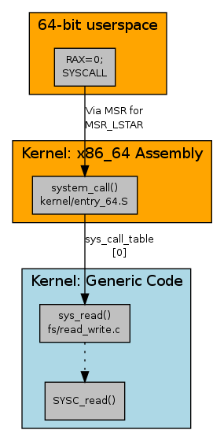

# Program Notes

These notes cover everything related to programs themselves. How they are run, memory addressing, elf, etc.

# Kernel Memory

## Address Types

1. User virtual addresses: seen by user-space programs. Each proccess has its own virtual address space 2. Physical Addresses: used between processor and system's memory.
3. Kernel logical addresses: Normal address space of the kernel. `kmalloc` returns kernel logical addresses. Treated as physical addresses (usually differ by a constant offset). Macro `__pa()` in `<asm/page.h` returns the associated physical address.
4. Kernel virtual addresses: do not necessary have a linear one to one mapping to physical addresses. All logical addresses _are_ vritual addresses. `vmalloc` returns a virtual address (but no direct physical mapping)

## Kernel GFP Flags

[link](https://lwn.net/Articles/920891/)

They are "get free page" flags, but now used much more widely. But only relevant for *full-page* allocations

# Linux Program Startup

## Linux x86 Program Start Up - or - How the heck do we get to main()

[link](http://www.dbp-consulting.com/tutorials/debugging/linuxProgramStartup.html)

# Process Memory

## Anatomy of a Program in Memory

[link](https://manybutfinite.com/post/anatomy-of-a-program-in-memory/)

Each process (in a multi-tasking OS) has its own memory sandbox, which is a virtual address space. Virtual addresses are mapped to physical memory through page tables, maintained by the kernel (and consulted by the processor). Once VA are enabled, all software including the kernel use it.

Some amount of the VA space must be reserved for the kernel. Because kernel space is flagged in the page table as exlusive to priviliged code (ring 2 or lower). Page fault is triggered if user mode programs try to touch it.

Kernel code is always addressable, ready to handle interrupts/system calls. User-mode memory changes when a process switch happens. A process has distinct bands, ranges of memory addresses, in address space correpsonding to **memory segments**.

## sbrk() is not thread safe

[link](https://lifecs.likai.org/2010/02/sbrk-is-not-thread-safe.html)

## sbrk() vs mmap()

[link](https://utcc.utoronto.ca/~cks/space/blog/unix/SbrkVersusMmap)

The highest address is called the *program break*. At program startup it would be the space at the top of the [bss](https://en.wikipedia.org/wiki/.bss): statically allocated variables. `brk()` and `sbrk()` are used to set and increment/decrement the program break respectively. Thus, gives you more memory and creates the *heap*.

In classical unix if you `free()` the right block at the top of the break, `malloc()` might eventually shrink the program break. This was simple linear memory. `mmap()` allowed for easily doing different 'arenas' of memory. Can also be used to directly allocate large objects. Then can drop mappings when unneeded or shrink the arenas. Still called the *heap* even though it is no longer continuous and linear.

# ELF

## Program Startup

### A Whirlwind Tutorial on Creating Really Teensy ELF Executables for Linux

[link](http://www.muppetlabs.com/~breadbox/software/tiny/teensy.html)

libc have a `_start` and an `_exit` routine. These provide portability for starting up and ending a program. You can create your own `_start` with the GCC option `-nostartfiles`. You need to call `_exit` though. You can use the GCC option `-nostdlib` to not link any system libraries or startup files.

Can use the `exit(2)` syscall rather than the libc call.

There is still the ELF file though with a large amount of overhead. There are a variety of different sections that are produced by the assembler.

TODO: finish notes

### How programs get run: ELF binaries

[link](https://lwn.net/Articles/631631/)

## `man 5 elf`

## ELF Sections

### text, data, and bss: Code and Data Size Explained*

[link](https://mcuoneclipse.com/2013/04/14/text-data-and-bss-code-and-data-size-explained/)

`.text` has functions & constant data (). In FLASH memory.

`.data` has initialized data. `int32_t x = 1235;` Not constant because can be changed. Counts for RAM & FLASH

`.bss` has uninitialized data. `int32_t x`. Counts for RAM

## Auxiliary Vectors

### About ELF Auxiliary Vectors*

[link](http://articles.manugarg.com/aboutelfauxiliaryvectors.html)

They are a mechanism to transfer certain kernel level information to the user processes. They are on the process stack after `envp` content, separated by  a null pointer. In C programs can pass `LD_SHOW_AUXV=1` to print out auxiliary vectors.

### Linux Kernel

`auxp` is filled in [binfmt_elf.c](https://github.com/torvalds/linux/blob/fc89d7fb499b0162e081f434d45e8d1b47e82ece/fs/binfmt_elf.c#L242)

### Rustix/Origin/Mustang

Rustix uses the `auxp` for params. It takes in `envp` and finds the null pointer separating it from `auxp`. Then it parses it: [link](https://github.com/bytecodealliance/rustix/blob/dd3de92d498f2f2bde6a312d42bbcd810d1db596/src/backend/linux_raw/param/mustang_auxv.rs#L112). This is performed before main in rustix: [link](https://github.com/sunfishcode/mustang/blob/e5c4ff5abd0e29842652b03dfb594cece74ce71b/origin/src/program.rs#LL77C16-L77C16).

## Constructors/Destructors

### Startup: Backward Constructors

[link](https://web.archive.org/web/20151205101506/https://blog.mozilla.org/tglek/2010/05/27/startup-backward-constructors/)

### `.init, .ctors, and .init_array`

[link](https://maskray.me/blog/2021-11-07-init-ctors-init-array)

Dynamic initializations for non-local variables before the main function. Calls functions in `init_array`. GCC reserves the first 100. Catch violations with `-Wprio-ctor-dtor`.

See [System V ABI](https://refspecs.linuxbase.org/elf/x86_64-abi-0.99.pdf) for the generic ABI quote source

## Thread Locals

Thread locals are variables that are local to the thread. When it is mutated, it is mutating a copy. When the thread exits, it is destructed (if necessary).

### Elf Handling for Thread-Local Storage - spec

[link](https://akkadia.org/drepper/tls.pdf)

### LLVM

[link](https://llvm.org/docs/LangRef.html#thread-local-storage-models)

A variable can be specified as `thread_local` which means each thread will have its own copy of the variable. Not all targets support this. Uses the ELF TLS models.

### All about thread-local storage

[link](https://maskray.me/blog/2021-02-14-all-about-thread-local-storage)

### A deep dive into (implicit) thread local storage

[link](https://chao-tic.github.io/blog/2018/12/25/tls)

### alloc-tls - thread local storage for global allocators (rust)

[link](https://github.com/ezrosent/allocators-rs/tree/master/alloc-tls)

(rust) Registering destructors for types that implement `Drop` requires allocation. This causes reentrancy for allocators. `alloc_thread_local!` can detect this

# Rust Programs

## Origin

[link](https://github.com/sunfishcode/mustang/tree/main/origin)

Origin for logging uses a function in `.init_array` to set up an `env_logger`. Cannot be used in `no_std`. Need to write your own `.init_array` function

## main()

Use `#[start]` (tracking [issue](https://github.com/rust-lang/rust/issues/29633)) or override the C `main` function. [Source](https://doc.rust-lang.org/beta/unstable-book/language-features/lang-items.html#writing-an-executable-without-stdlib)

Rust stdlib uses the start function to initialize its [runtime](https://sourcegraph.com/github.com/rust-lang/rust/-/blob/library/std/src/rt.rs?L99%3A39=). A key thing to note is it uses a `panic::catch_unwind`. Panicking from a main function is undefined behavior right now (more notes in tracking issue). Inside it also calls the platform specific init. [unix init](https://sourcegraph.com/github.com/rust-lang/rust/-/blob/library/std/src/sys/unix/mod.rs?L53=).

## init_array and args

On unix stdlib uses init_array to initialize args because glibc passes argc, argv, and envp to function in the `.init_array`. See [source](https://github.com/rust-lang/rust/blob/6c991b07403a3234dd1ec0ac973b8ef97055e605/library/std/src/sys/unix/args.rs#L109)

# Linking

## A ToC of the 20 part linker essay

[link](https://lwn.net/Articles/276782/)

## Linkers and Loaders

[link](https://linker.iecc.com/)

##  A beginner's guide to linkers

[link](https://www.lurklurk.org/linkers/linkers.html#namemangling)

## LLVM Linkage Models

[link](https://llvm.org/docs/LangRef.html#linkage-types)

## Rust linkage feature

[tracking issue](https://github.com/rust-lang/rust/issues/29603)

# Stack Frames/Unwinding

## Don't panic: guide to rust unwinding

[link](https://lucumr.pocoo.org/2014/10/30/dont-panic/)

## DWARF-based Stack Walking Using eBPF

[link](https://www.polarsignals.com/blog/posts/2022/11/29/profiling-without-frame-pointers/)

## Unwinding the stack the hard way

[link](https://lesenechal.fr/en/linux/unwinding-the-stack-the-hard-way)

# Linux System Calls

## Anatomy of a system call, part 1

[link](https://lwn.net/Articles/604287/)

Special instructions are needed to make the processor perform a transition to ring 0.
Functions are addressed by number rather than address.

In the kernel they are defined with the `SYSCALL_DEFINEn()` macro. It produces a `__SYSCALL_DEFINEx()` and a `SYSCALL_METADATA()` macro. The [metadata macro](https://lwn.net/Articles/604406/) builds a collection of metadata for tracing purposes (for `CONFIG_FTRACE_SYSCALLS`). The `__SYSCALL_DEFINEx()` expands to the actual syscall function. The type signatures are `long int` for correctly sign extending 32 bit values. They use the [asmlinkage](https://kernelnewbies.org/FAQ/asmlinkage) directive which tells that the function should expect arguments on the stack rather than registers.

To get to the function, a syscall table is used for mapping the numbers to function pointers. Syscall tables can be implemented differently for each architecture and have different syscall number mappings.

**x86_64**:

Early in the kernel's [startup](https://elixir.bootlin.com/linux/v3.14/source/arch/x86/kernel/cpu/common.c#L1277) sequence calls [syscall_init](https://elixir.bootlin.com/linux/v3.14/source/arch/x86/kernel/cpu/common.c#L1134). Uses the `wrmsrl` instruction to write values to a [model-specific register](https://wiki.osdev.org/Model_Specific_Registers). Wrties to `MSR_LSTAR` which is the x86\_64 register for `SYSCALL` instructions. We set it to `system_call`.

Table is accessed from the [system_call](https://elixir.bootlin.com/linux/v3.14/source/arch/x86/kernel/entry_64.S#L593) assembly entry point. Pushes various registers onto stack using `SAVE_ARGS` macro to match `asmlinkage` directive. Uses the RAX register to pick entry and then calls it.

## Anatomy of a system call part 2

[link](https://lwn.net/Articles/604515/)

Lays out how some other arches work and x86\_32 syscalls on x86\_64

**vDSO (Virtual Dynamically-linked Shared Object)**:

* Also see [Linux Journal](https://www.linuxjournal.com/content/creating-vdso-colonels-other-chicken)

Some system calls read a small amount of information from the kernel, do not want the overhead of a ring transition.

TODO

*syscall tracing with `ptrace()`*

TODO

# Userfaultfd

`man 2 userfaultd`

File descriptor that handles page faults in user space. The userfaultfd is polled from a second thread. When a fault occurs the faulting thread goes to sleep. The userfaultfd reader is expected to load the page in.

# Non-Local Jumps & Signal Handling

Links:
* [How setjmp and longjmp work](https://offlinemark.com/2016/02/09/lets-understand-setjmp-longjmp/)
* [Working with signals in Rust - some things that signal handlers can't handle](https://www.jameselford.com/blog/working-with-signals-in-rust-pt1-whats-a-signal/)
* [Unwinding through a signal handler](https://maskray.me/blog/2022-04-10-unwinding-through-signal-handler)

My port of musl setjmp/longjmp to rust: [sjlj](https://github.com/jordanisaacs/sjlj)

From [anonymous]: 

> you can't longjmp in a signal handler because you need to either hit the return trampoline
> or sigreturn you can modify the sigcontext to resume your setlongjmp-style context instead though

Tidbit on the return trampoline

> when the kernel delivers a signal it creates a new stack to run your handler on.
> libcs will set the return address for the stack (or the link register on other architectures etc)
> to be a "trampoline" which is just a small snippet that calls sigreturn so that returning
> from the handler resumes execution of your program correctly.
> [link to linux kernel](https://github.com/torvalds/linux/blob/d6c338a741295c04ed84679153448b2fffd2c9cf/arch/x86/um/signal.c#L360).
> it's that signal registering sets SA_RESTORER which the kernel sets as the return address for the signal handler stack,
> and im pretty sure libcs just have their sigaction etc always set SA_RESTORER to their sigreturn trampoline

Do not need to care about the trampoline because not using libc. At least in musl, the `SA_RESTORER` function is just the `sigreturn` syscall. It is not necessary to call `sigreturn` from a signal. It seems that the handler is not called if no `SA_RESTORER` is provided so just do it like musl with a single call to `sigreturn`.

## Safety of setjmp/longjmp in Rust:

* The [Plain Old Frame](https://blog.rust-lang.org/inside-rust/2021/01/26/ffi-unwind-longjmp.html) are frames that can be trivially deallocated. A function that calls `setjmp` cannot have any destructors.
* Also take care for [returning twice](https://github.com/rust-lang/rfcs/issues/2625) and doing volatile read/writes if that is the case
